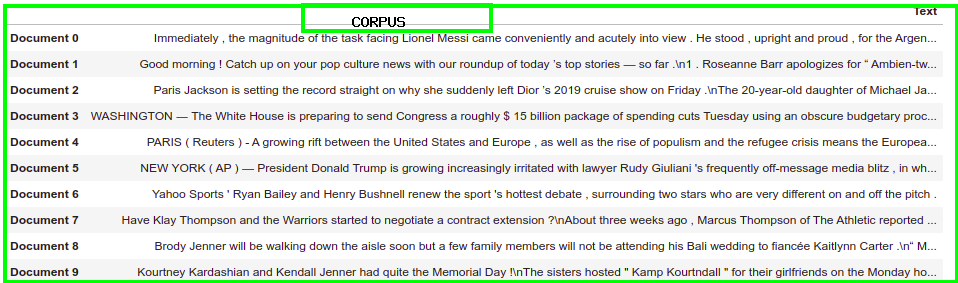
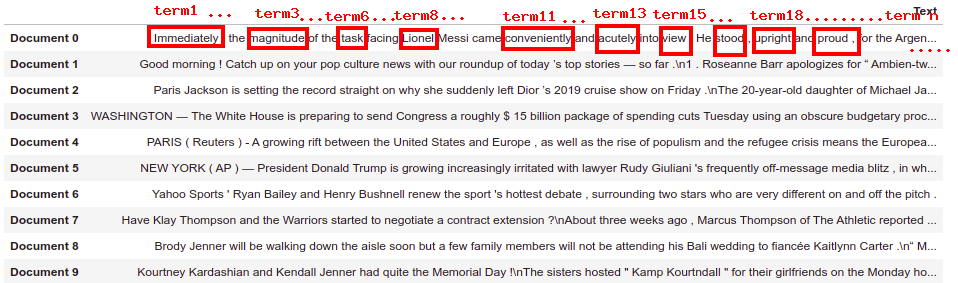
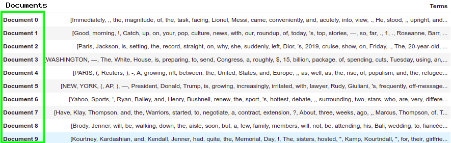

# Feature Extraction and Vectorization for NLP

[^Subtitle]: Feature Extraction methods for Natural Language Processing and Information Retrieval

Natural language processing is a sub-field of machine learning that deals with helping machine and computers understand and comprehend natural language spoken by humans. Machine learning models and algorithms as we know them, needs our input features to be represent in numbers, so "How do we represent language in numerical terms?".  The beauty about natural language vectorization is that it also helps us as humans to understand the nature of the corpus we're dealing with in general.

We deal with this incrementally, understanding basic terms before we touch on some basic feature vectorization methods and coding them from scratch.

[TOC]

# Basic Terms

## Corpus

This is a collection of various documents and is mostly used to refer to the totality of all text available to us in our task.



## Term

A term commonly  referred to as words or tokens (if it's word-level tokenization) in our text, is a collection of characters. Example: a collection of b, o, y with give the word "boy" and a collection of characters "s, l, o, w" will give the word "slow".

To Do: Check if while using Char-Level Tokenization (Don't want to say Char-Level RNN n shi), tokens can be referred to as terms.



## Documents

A document is a collection of terms, either to form a couple of texts, phrase, sentence, one or more paragraphs.



# Basic NLP Features Vectorization

Let's create a abstrfeature_extraction_nlp.pyact class for all our feature vectorization classes to sub-class from.


## Term Frequency


$$
Term Frequency (Tf) = Number of times term appears in document /Number of Terms in Documents
$$
Term frequency is focused more on individual documents, it gives more weight to words that appear frequently in a document. The maximum term frequency a term or word can have is 1. Term frequency results can be fitted in a (D, T) table or can be transposed to (T, D) which is commonly refereed to as a `Document Term Matrix`.

where D = Number of Documents & T = Number of unique terms in corpus.

Below is a custom code to get term frequency of a tokenized corpus.

```python
from collections import Counter

class TermFrequencyVectorizer():
    vocab = Counter()

    def __init__(self, corpus: list[list[str]], as_array=False) -> None:
        """
        @arguments:
        corpus: list of list of string
            corpus with all docuemnts tokenized.
        """
        self.corpus = corpus
        self.as_array = as_array
    
    def fit(self) -> None:
        if self.as_array is True:
            self.get_vocab(self.vocab)
            self.terms = list(dict(self.vocab).keys())
            n_docs = len(self.corpus)
            n_terms = len(self.terms)
            array = np.zeros(shape=(n_docs, n_terms))
            
            # for every document
            for i, doc in enumerate(self.corpus):
                terms = set(doc) # get just the unique terms and not all terms
                for term in terms:
                    pos = self.terms.index(term)
                    tf = doc.count(term) / len(terms)
                    array[i, pos] = tf
            return array
        else:
            self.tf = []
            for doc in self.corpus:
                terms = set(doc)
                n_terms = len(terms)
                doc_tf = {}
                for term in terms:
                    doc_tf[term] = doc.count(term) / n_terms
            self.tf.append(doc_tf)
        

    def transform(self):
        pass

    def get_vocab(self, vocab: Counter):
        for doc in self.corpus:
            self.vocab.update(doc)
            
tf_vectorizer = TermFrequencyVectorizer(corpus=all_news_tokenized, as_array=True)
_ = tf_vectorizer.fit()
pd.DataFrame(_, columns=tf_vectorizer.terms)
```

## Document Frequency

$$
df = frac(Number of Documents, Number of ocuurences of term t in all documents)
$$

The document  frequency, if we try to infer the meaning just from it's name should be ...
$$
df = frac(Number of occurrence of document, Number of Documents)
$$
For this to make sense, then we should have document duplicates, just thinking about it doesn't make sense right?

Document frequency basically represent the frequency of a term or word in the all documents or corpus. Also the resulting shape would fit on a column vector. Sometimes the document frequency of a term goes above 1. A term having a high document frequency, means such a term occurs a lot in the scope of the corpus, stopwords will have high document frequency if they've not be cleaned form our data.


Document Frequency from scratch in python
```python
from collections import Counter

class DocumentFrequency:
    def __init__(self, corpus: list):
        self.corpus = corpus
        self.vocabulary_ = Counter()
        self.df = {}
    
    def get_vocab_(self):
        for docs in self.corpus:
            self.vocabulary_.update(docs)

    def get_df(self):
        self.get_vocab_()
        
        for term, term_frequency in dict(self.vocabulary_).items():
            self.df[term] = term_frequency / len(self.corpus)
        
        return self.df


df_vectorizer = DocumentFrequency(corpus=brown.sents())
df = df_vectorizer.get_df()
```

## Binary Bag of Words

Binary bag of words is a feature vector of shape (D, T) where the element-wise values are either 1 or 0 to indicate if a term is present in a document or not. This also like the others has no semantical representation and a more degraded syntactical representation which just shows if word is present or not.

#### Pros

1. Simple

#### Cons

1. Size increased with more terms
2. Not computationally efficient

## Bag of Words (Same as Document Frequency..think about it)


## Inverse Document Frequency

...
$$
df = frac(Number of ocuurences of term t in all documents, Number of Documents)
$$


## Term Frequency - Document Frequency